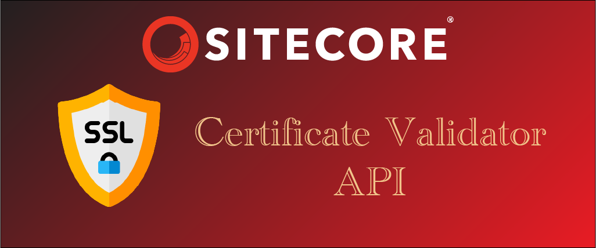

# 🔐 Sitecore Certificate Checker API

A Sitecore backoffice API that lists installed SSL certificates and validates their expiration. Useful for monitoring `xConnect`, CMS, or custom SSL certificate lifetimes directly from within Sitecore.

---
## 📦 Features

- Lists certificates from the local machine's certificate store.
- Identifies if certificates are expired.
- Filters configured certificates based on a Sitecore patch config.
- Supports optional URL parameter for filtering by certificate name, subject or thumbprint.
  
## 🚀 API Endpoints

| Method | URL                                                                 | Description                                 |
|--------|----------------------------------------------------------------------|---------------------------------------------|
| GET    | `/certificates/check`                            | List all certificates                       |
| GET    | `/certificates/check/{name}`                     | Get a specific certificate by name |
| GET    | `/certificates/check/{subject}`                     | Get a specific certificate by subject |
| GET    | `/certificates/check/{thumbprint}`                     | Get a specific certificate by thumbprint |

---

## 🔐 Securing the API with Sitecore Services API Key

This API is secured using **Sitecore Services API Keys**.

### ✅ Steps to Create an API Key:

1. In Sitecore Content Editor, go to:
    ```
    /sitecore/system/Settings/Services/API Keys
    ````

2. Right-click → **Insert → API Key**

3. Configure the fields:
   - **Allowed Controllers**:  
     ```
     SCXM.CertificateValidator.Controllers.CertificateCheckerController
     ```
   - Leave other fields blank unless you want to restrict to certain roles or users.
   - Copy the generated `API Key` (the item id)
4. Recycle the Sitecore App Pool (or restart Sitecore) — required for the new API key to take effect.


## 📥 Example API Calls

### 🔧 Headers

| Key         | Value                                      |
|-------------|--------------------------------------------|
| `sc_apikey` | Your Sitecore API Key (GUID format)        |

---

### 🧪 Example: Get All Certificates

```http
GET https://your-sitecore-domain/certificates/check
Headers:
sc_apikey: A250220A-5BB3-48C1-A4B2-69300D38DA52
````
🔄 Response (200 OK)
```json
[
  {
    "subject": "CN=sitecore.xconnect",
    "thumbprint": "ABCDEF1234567890ABCDEF1234567890ABCDEF12",
    "issuer": "CN=MyRootCA",
    "friendlyName": "xConnectCert",
    "notBefore": "2024-05-01T00:00:00Z",
    "notAfter": "2025-05-01T00:00:00Z",
    "storeName": "My",
    "storeLocation": "LocalMachine"
  },
  {
    "subject": "CN=sitecore.cms",
    "thumbprint": "1234567890ABCDEF1234567890ABCDEF12345678",
    "issuer": "CN=MyRootCA",
    "friendlyName": "SitecoreCert",
    "notBefore": "2023-06-01T00:00:00Z",
    "notAfter": "2025-06-01T00:00:00Z",
    "storeName": "My",
    "storeLocation": "LocalMachine"
  }
]
```

### 🧪 Example: Get Certificate by Name

```http
GET https://your-sitecore-domain/certificates/check/xConnectCert
Headers:
  sc_apikey: A250220A-5BB3-48C1-A4B2-69300D38DA52
```

🔄 Response (200 OK)
```json
{
  "subject": "CN=sitecore.xconnect",
  "thumbprint": "ABCDEF1234567890ABCDEF1234567890ABCDEF12",
  "issuer": "CN=MyRootCA",
  "friendlyName": "xConnectCert",
  "notBefore": "2024-05-01T00:00:00Z",
  "notAfter": "2025-05-01T00:00:00Z",
  "storeName": "My",
  "storeLocation": "LocalMachine"
}
```

### ❌ Response: Invalid API Key

```json
{
  "Message": "400 Bad Request - API Key is not valid"
}
```

## ⚙️ Configuration

Certificates can be defined in a Sitecore patch config:

```xml
<configuration xmlns:patch="http://www.sitecore.net/xmlconfig/">
  <sitecore>
    <scxm>
      <certificateChecker type="SCXM.CertificateValidator.Configurations.CertificateConfigurator, SCXM.CertificateValidator">
        <certificates hint="list:AddCertificates">
          <certificate name="xConnectCert" thumbprint="ABCDEF1234567890ABCDEF1234567890ABCDEF12" />
          <certificate name="SitecoreCert" thumbprint="1234567890ABCDEF1234567890ABCDEF12345678" />
        </certificates>
      </certificateChecker>
    </scxm>
  </sitecore>
</configuration>
````

## 🧱 Project Structure

* `Controllers/CertificateCheckerController.cs` – Web API controller
* `Configurations/CertificateConfigurator.cs` – Loads configured certificates
* `Models/CertificateConfigModel.cs` – Model for certificate metadata
* `App_Config/Include/SCXM/Feature.CertificateValidator.config` – Patch config

## 🚀 Deployment Notes

* Build and deploy the DLL to the Sitecore `/bin/` folder.
* Place the `.config` file in `/App_Config/Include/SCXM/`.

    ### Release Package

    The latest release can be found at [Releases]([/guides/content/editing-an-existing-page#modifying-front-matter](https://github.com/hishaamn/scxm-certificate-validator/releases))

## 🔁 Notes

* API Key changes **require a Sitecore App Pool restart** to take effect
* Controller must be registered in config under:

  ```xml
  <allowedControllers>
    <controller type="SCXM.CertificateValidator.Controllers.CertificateCheckerController, SCXM.CertificateValidator" />
  </allowedControllers>
  ```
